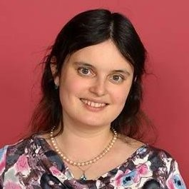

# 👩‍💻 Liubov Dumarevskaya, PhD  
**Full-Stack GIS | Spatial Data Science | Remote Sensing**  

📍 Greater Boston Area  
📧 [luba.dm@gmail.com](mailto:luba.dm@gmail.com) | 📱 847-530-7797 | [LinkedIn](https://www.linkedin.com/in/liubov-dumarevskaya-phd-26020020/)  

---

## 🐈 About Me  
I am a **GIS and Remote Sensing specialist with 10+ years of experience** delivering scalable, data-driven solutions for environmental, infrastructure, and public health initiatives.  

My expertise spans the **Esri ecosystem, geospatial automation, cloud GIS, and full-stack development**, bridging the gap between research, technology, and applied decision-making.  

With a strong background in **Python, JavaScript, geospatial analytics, and predictive modeling**, I build tools and workflows that transform complex datasets into actionable insights.  

🌍 Passionate about developing **applied geospatial solutions** that empower organizations, improve sustainability, and support community resilience.  

---

## 🛠️ Technical Skills  

### 🗺️ GIS & Remote Sensing  
  
  
  
  
  

### 💻 Programming & Web Development  
  
  
  
  
  
  
  
  

### 🔄 Automation & ETL  
  
  
  
  

### 📊 Data Visualization  
  
  
  
  
  
  

### ☁️ Cloud & DevOps  
  
  
  

### 🤝 Collaboration  
  
  
  
  
  

---

## 💼 Experience  

**Software Developer (GIS)** | *CDC Foundation / Rhode Island Dept. of Health*  
*Jan 2025 – Present*  
- Built full-stack geospatial web apps (Esri JS API, Leaflet, Python).  
- Managed ArcGIS Enterprise in hybrid & cloud environments.  
- Automated ETL workflows for public health data.  
- Developed dashboards, visualizations, and geoprocessing services.  

**Board of Directors** | *Geospatial Professionals Network of New England*  
*Apr 2025 – Present*  
- Coordinated sponsorship, website updates, and outreach.  

**Remote Sensing Research Assistant** | *University of Rhode Island*  
*Sep 2020 – Oct 2024*  
- Developed spatial models (Random Forest, segmentation, classification) with LiDAR, aerial, and satellite data.  
- Delivered forest health datasets to RIGIS.  
- Presented research at NEARC, NEFPC, and published peer-reviewed articles.  

**Teaching Assistant – Fundamentals in GIS** | *University of Rhode Island*  
*Sep 2021 – Aug 2024*  
- Delivered hands-on GIS & Python instruction.  
- Created interactive course materials using StoryMaps & ModelBuilder.  

**Habitat Monitoring Specialist** | *River Valley Nature Reserve, Russia*  
*Apr 2017 – Oct 2019*  
- Conducted GIS-based habitat mapping for endangered species.  

**Research Associate** | *Moscow State University*  
*Sep 2011 – Oct 2017*  
- Built national-scale GIS models for land use, infrastructure, and ecological monitoring.  

---

## 🎓 Education  

- **PhD, Earth & Environmental Sciences** – University of Rhode Island, 2024  
- **Graduate Certificate, GIS & Remote Sensing** – University of Rhode Island, 2022  
- **MSc, Biodiversity & Bioindication** – Moscow State University, 2012  

---

## 📜 Certifications  

- Applied Machine Learning in Python – University of Michigan (2022)  
- Spatial Data Science: The New Frontier – Esri (2021)  

---

## 🌍 Professional Activities  

- **Board of Directors** – Geospatial Professionals Network of New England  
- **Publications:** 8 peer-reviewed papers, 2 GIS packages on RIGIS  
- **Conferences:** Speaker at NEARC & NEFPC (forest mortality modeling, infrastructure resilience, environmental management)  

---

👉 Open to **collaborations, applied research, and opportunities in GIS, remote sensing, and spatial data science.**  
